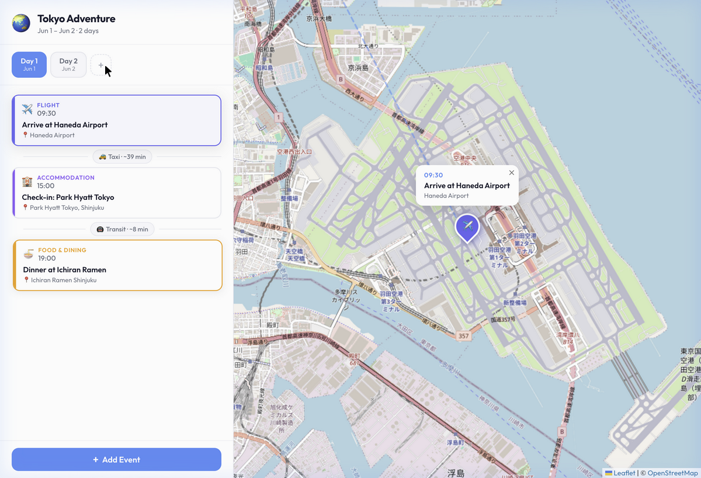

# 🌍 Interactive Travel Planner

A premium, interactive web application designed to help you seamlessly organize your trips. Build a multi-day itinerary with flights, dining reservations, shopping plans, and daily activities, all visualized on a beautiful, dynamic map interface.

## 📸 Preview



## ✨ Core Features
*   **Multi-Day Planning:** Easily organize your trip day-by-day.
*   **Interactive Map:** A responsive map that automatically focuses on your planned locations, featuring custom category pins.
*   **Itinerary Builder:** Categorize events (Flights, Food, Shopping, Accommodations, Activities) with precise timings.
*   **Premium Aesthetics:** A clean, modern UI featuring glassmorphism accents, smooth micro-animations, and sharp typography.

## 🚀 Tech Stack
*   **Frontend Framework:** React + Vite
*   **Styling:** Vanilla CSS 
*   **Map Provider:** Leaflet.js (`react-leaflet`)
*   **State Management:** Zustand

## 🛠️ Getting Started

### Prerequisites
Make sure you have Node.js installed (v18+ recommended).

### Installation & Setup
1. Clone the repository:
   ```bash
   git clone https://github.com/Kafiling/Travel-Planner-Claude-Antigravity-Demo.git
   ```
2. Navigate to the project directory:
   ```bash
   cd "Travel Planner"
   ```
3. Install dependencies:
   ```bash
   npm install
   ```
4. Start the development server:
   ```bash
   npm run dev
   ```
5. Open your browser and navigate to `http://localhost:5173`.
